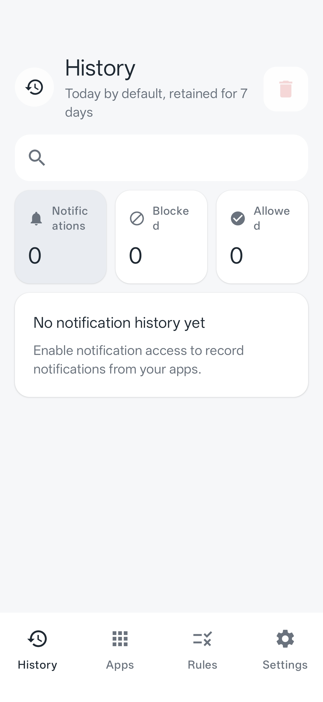
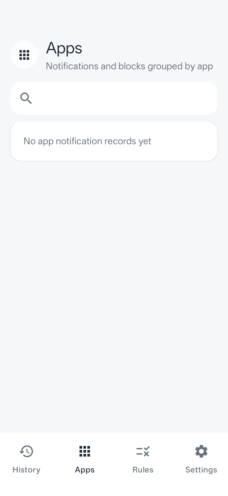
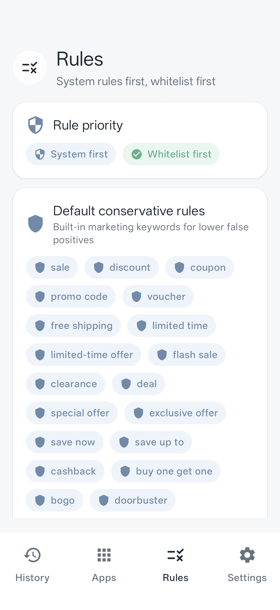
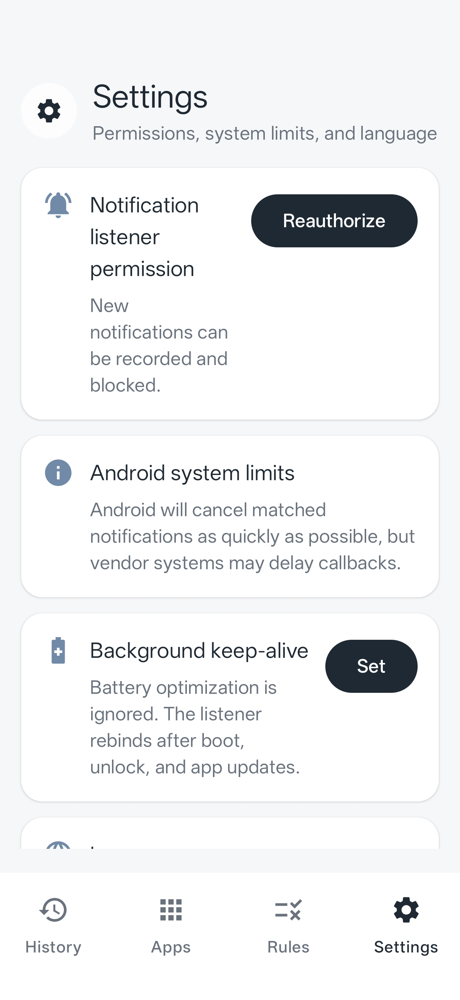

# Notification Silencer

Notification Silencer is an Android app that records app notifications and blocks marketing-style push notifications through Android's `NotificationListenerService`.

The project currently includes:

- Notification listener service registration and health checks.
- System allowlist, user whitelist, user blacklist, default marketing keywords, and stricter marketing rules.
- Separate default keyword sets for English and Chinese. The English rules are not direct translations of the Chinese rules.
- History, apps, rules, and settings tabs.
- Manual rule creation from the Rules tab.
- Smear-to-select keyword marking from notification history.
- App-level one-tap blocking from the Apps tab.
- Periodic active-notification scanning to clear missed blocked notifications.
- Background keep-alive helpers for boot, unlock, app update, and battery optimization settings.
- A separate `:push-tester` module for sending real local test notifications.

## Screenshots

| History | Apps |
| --- | --- |
|  |  |

| Rules | Settings |
| --- | --- |
|  |  |

## Language

The app supports:

- System language
- English
- Chinese

Language can be changed in **Settings > Language**. UI text and default marketing keyword rules follow the selected language.

## Default English Marketing Keywords

The English default rules are based on common e-commerce and re-engagement push notification patterns:

- Conservative rules: `sale`, `discount`, `coupon`, `promo code`, `free shipping`, `limited time`, `flash sale`, `clearance`, `exclusive offer`, `cashback`, `price drop`, `today only`, `ends tonight`, and similar high-confidence marketing phrases.
- Strict rules: `new arrivals`, `back in stock`, `low stock`, `selling fast`, `recommended for you`, `abandoned cart`, `complete your purchase`, `members only`, `early access`, `reward`, `giveaway`, `last chance`, `shop now`, and similar conversion or re-engagement phrases.

## Build

Use JDK 17 and the Android SDK:

```bash
JAVA_HOME=/path/to/jdk17 \
ANDROID_HOME=/path/to/android-sdk \
ANDROID_SDK_ROOT=/path/to/android-sdk \
sh ./gradlew :app:assembleDebug
```

The project also configures Aliyun Maven mirrors before the official repositories to make dependency resolution more reliable in mainland China.

## Push Tester

The repo includes a standalone module, `:push-tester`, with package name `com.hugo.pushtester`. It sends real notifications for validating listener permission, matching, blocking, and history recording.

Build it with:

```bash
JAVA_HOME=/path/to/jdk17 \
ANDROID_HOME=/path/to/android-sdk \
ANDROID_SDK_ROOT=/path/to/android-sdk \
sh ./gradlew :push-tester:assembleDebug
```

Basic flow:

1. Install `:app`.
2. Grant Notification Silencer notification listener access in Android settings.
3. Install `:push-tester` and allow it to post notifications.
4. Send a marketing notification and verify that it is blocked and appears in History.
5. Send logistics or security notifications and verify that they are allowed unless user rules match.

## 中文说明

通知静默是一个安卓通知静默拦截 App，通过 Android `NotificationListenerService` 记录通知，并尽快取消命中营销规则的推送。

当前功能包括：

- 通知监听服务声明、健康检查和重绑定。
- 系统白名单、用户白名单、用户黑名单、默认营销词、增强营销词的规则引擎。
- 中文和英文分离的默认关键词配置，英文规则不是中文规则的简单翻译。
- 历史页、应用页、规则页、设置页。
- 规则页手动添加规则。
- 历史通知涂抹选词添加黑/白名单。
- 应用页点击应用图标一键拦截/解除该 App 全部通知。
- 每 30 秒扫描通知栏，清理漏拦通知。
- 开机、解锁、应用升级后的常见保活重绑逻辑，以及电池优化设置入口。
- 独立 `:push-tester` 模块，用于发送真实通知测试。

### 语言

可在 **设置 > 语言** 中选择：

- 跟随系统
- English
- 中文

界面文案和默认营销关键词规则都会跟随所选语言。
